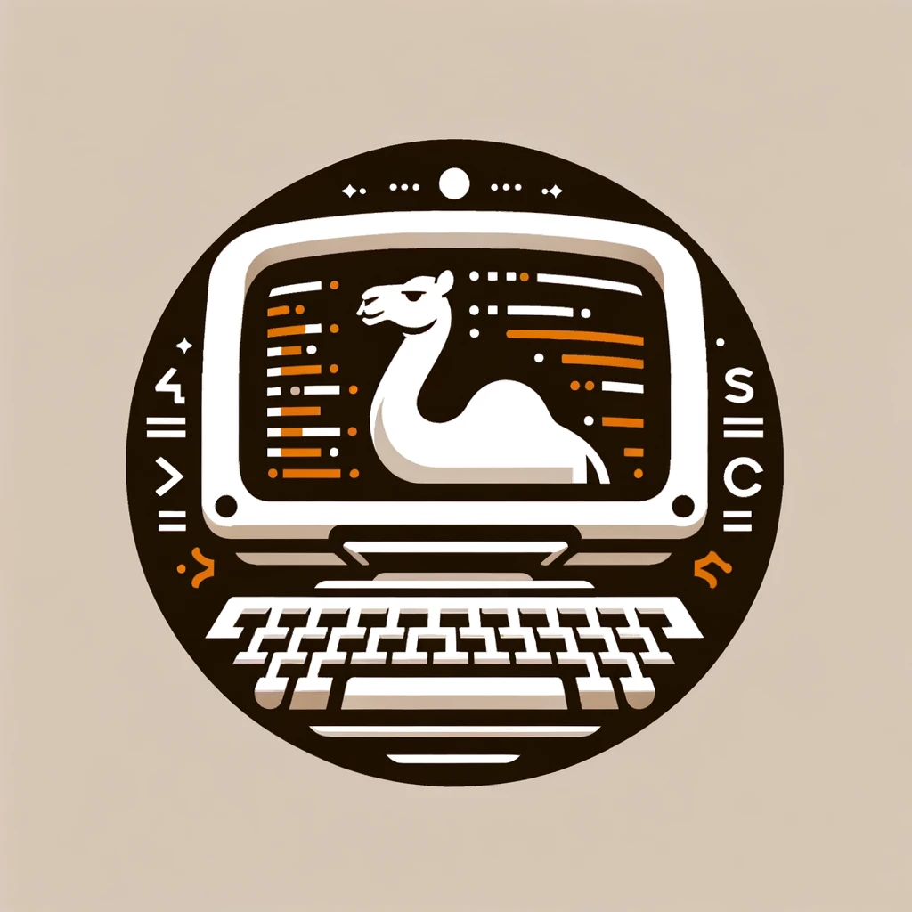
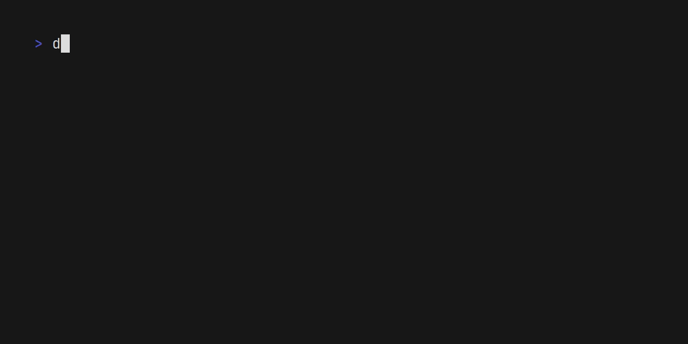

<h1 align="center"></h1>

# Terminal Manipulation Library

Terml is a pure-ocaml library for manipulating terminal output. Making
possible to write text-based interfaces with ease.

The library is designed to be simple and easy to use. Inspired by the
rust [Crossterm](https://github.com/crossterm-rs/crossterm) library.


## Tutorial
Check out the [examples](./examples) directory to see examples that range 
from basic applications to more complex ones.

### Getting started
In this tutorial, we will print a colored text prompting the user to type
something.

We will start by adding terml as a library dependency to our project.

```ocaml
(executable
  (name my_terml_app)
  (libraries terml))
```

Now we need to install the library using `opam`.

```bash
opam install terml
```

Opam will install the library and its dependencies, and after that, we can run
`dune build` to check if everything went well.

Awesome, now we can start writing our application. Start by creating a new
`main.ml` file and open the `Terml` module.

```ocaml
open Terml
```

In this tutorial, we will start by setting the terminal to `raw mode`, this will
allow us to read input without the need of pressing enter.

```ocaml
let () =
  let restore = Terminal.enable_raw_mode () in
```

`enable_raw_mode` returns the previous state of the terminal, so we can restore
it later.

Now we can make our colored text. This is done by using the `Style` module.

```ocaml
let () =
  let restore = Terminal.enable_raw_mode () in
  let greeting =
    Style.(
      styled ()
      |> bg (Color.from "#c1121f")
      |> fg (Color.from "#fdf0d5")
      |> bold
      |> make "Type anything below: ")
  in
```

We are using the `styled` function to create a new styled type, then we are
applying styles to it. And finally, we are applying the styles to text 
using the `make` function.

Great, now we will print the text to the terminal, and also enter the alternate
screen mode. This is done by the `Command` module.

```ocaml
let () =
  let restore = Terminal.enable_raw_mode () in
  let greeting =
    Style.(
      styled ()
      |> bg (Color.from "#c1121f")
      |> fg (Color.from "#fdf0d5")
      |> bold
      |> make "Type anything below, use 'q' to exit: ")
  in
  Command.execute
    [
      Command.Terminal Terminal.EnterAlternateScreen;
      Command.Terminal Terminal.(ClearScreen All);
      Command.Cursor Cursor.(MoveTo (1, 1));
      Command.Print greeting;
      Command.Cursor Cursor.(MoveTo (2, 1));
    ]
```

Here we are using the `execute` function to run a list of commands. We are
entering the alternate screen mode, clearing the screen, moving the cursor to
the top-left corner, printing the greeting, and moving the cursor to the second
line, where the user will type.

Awesome, now we just need to read the user input and print it to the terminal.
This is easily done by the `Events` module.

```ocaml
let () =
  let restore = Terminal.enable_raw_mode () in
  let greeting =
    Style.(
      styled ()
      |> bg (Color.from "#c1121f")
      |> fg (Color.from "#fdf0d5")
      |> bold
      |> make "Type anything below, use 'q' to exit: ")
  in
  Command.execute
    [
      Command.Terminal Terminal.EnterAlternateScreen;
      Command.Terminal Terminal.(ClearScreen All);
      Command.Cursor Cursor.(MoveTo (1, 1));
      Command.Print greeting;
      Command.Cursor Cursor.(MoveTo (2, 1));
    ];
  let should_quit = ref false in
  let channel = Events.poll () in
  while not !should_quit do
    let event = Event.sync (Event.receive channel) in
    match event with
    | Events.Key { code = Char "q"; _ } -> should_quit := true
    | Events.Key { code = Char c; _ } -> Command.execute [ Command.Print c ]
    | _ -> ()
  done;
  Command.execute [ Command.Terminal Terminal.LeaveAlternateScreen ];
  Terminal.disable_raw_mode restore
```

Ok, we just did a lot of things, let's break it down.

We are creating a boolean reference to define when to quit the application.
Then, we are using `Events.poll`. This function returns a channel that we can
use to receive events.

We are using a while loop to keep the application running until the user types
`q`. Inside the loop, we receive events from the channel and match them.

Events can be of different types, in this case, we are only interested in the
`Key` variant. Also, for simplicity, we ignore all other fields of the event.

If the user types `q`, we set the `should_quit` reference to `true`, and the
application will exit the loop.

If the user types any other character, we print it to the terminal.

Finally, we leave the alternate screen mode and disable the raw mode.

Wow, that was a lot. But we did it! We created our first Terml application,
lets run it.

```bash
dune exec my_terml_app
```

And that's it! You should see a colored text prompting you to type something, 
Like this:


